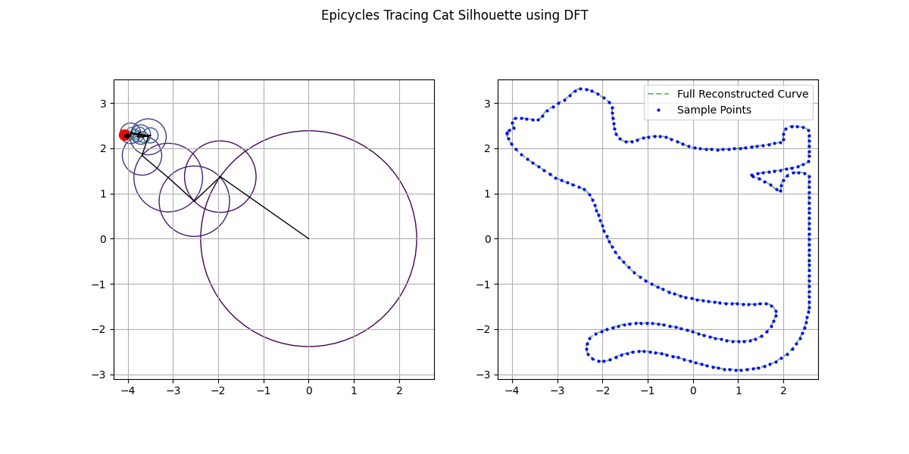

# Epicycle Shape Tracer: DFT-Powered Animations from Silhouettes

  
*(Watch epicycles whirl to trace a cat—30 harmonics from FFT magic!)*

This repo brings the ancient "epicycles" concept into modern math art: Use the **Discrete Fourier Transform (DFT)** to decompose any closed shape (letters like 'M' or 'Π', or silhouettes like cats) into spinning circles that reconstruct it. Inspired by GeoGebra animations, it's a fun way to visualize Fourier series geometrically—no more dry equations!

## What is the "Circle FFT" Concept?
The "circle FFT" (our playful name for epicycles via Discrete Fourier Transform) dates back to Ptolemy's geocentric model: Earth-centered orbits explained by deferent circles + smaller epicycles. Fast-forward to today—the DFT (core of the Fast Fourier Transform, FFT) does the same for shapes!

- **How it Works (Math Lite)**: Sample a closed curve into N points (complex numbers z_n = x_n + i y_n). DFT computes coefficients X_k = (1/N) ∑ z_n e^(-i 2π k n / N), where |X_k| is the radius of the k-th epicycle, arg(X_k) its phase, and k its rotation speed (frequency).
- **Reconstruction**: z(t) ≈ ∑ X_k e^(i k t) for t ∈ [0, 2π]—chain epicycles (largest first) to animate the trace. Low k = smooth curves; more = details (e.g., 20 for letters, 30+ for cats).
- **Why Cool?** Turns arbitrary outlines into hypnotic gear-like systems. Perfect for teaching trig interpolation or signal processing visually—trace a cat, and it "lives" via math waves!

See the [original paper](https://mathed.miamioh.edu/index.php/ggbj/article/view/197) for GeoGebra details (e.g., Homer Simpson with 1000 epicycles!).

## Quick Start
1. Clone: `git clone https://github.com/m15-ai/epicycle-shape-tracer.git`
2. Install deps: `pip install numpy matplotlib pillow opencv-python scipy` (in a venv).
3. Run examples:
   - Cat: Save a white-on-black PNG as `cat.png`, run `python apicycles-cat.py` → `cat_epicycles.gif`.
4. Customize: Edit `get_shape_points()` in scripts for new silhouettes (e.g., upload Homer PNG).

Outputs: Static plots (spectrum + outline) + animated GIF (epicycles tracing). Convert GIF to MP4: `python xvert.py`.

## How the Code Works
Core flow in `cat.py` (adaptable to others):
1. **Shape Sampling**: `get_cat_points_from_image()` uses OpenCV to extract contour from PNG (CHAIN_APPROX_NONE for dense points), normalizes, resamples to N=256 via cubic interp (SciPy) for uniform arc length.
2. **DFT**: `np.fft.fft(z) / N` → coefficients X_k (complex radii/phases).
3. **Epicycles**: Sort by magnitude (`get_epicycle_params`), chain M=30 largest in animation loop.
4. **Reconstruct & Animate**: Matplotlib FuncAnimation updates circle centers/lines; partial trace builds over frames (like paper's Remark 1).
5. **Spectrum Plot**: Log |X_k| vs. k shows decay—low freqs dominate smooth shapes.

For letters (e.g., `m_epicycles.py`): Parametric segments (lines/arcs) instead of contours.

Troubleshoot: If contour fails, check `thresh.png` (white shape on black); tweak threshold=100.

## Libraries Used
- **NumPy**: Arrays, FFT (`np.fft.fft`).
- **Matplotlib**: Plots, animations (`FuncAnimation`, `Circle`).
- **OpenCV (cv2)**: Contour extraction from images.
- **SciPy**: Interpolation for resampling.
- **Pillow**: GIF saving (via Matplotlib writer).

No extras—runs on Python 3.8+.

## Credits & License
- **Core Idea**: Heavily inspired by *"Tracing Closed Curves with Epicycles: A Fun Application of the Discrete Fourier Transform"* by Juan Carlos Ponce Campuzano (North American GeoGebra Journal, Vol. 11, No. 1, 2022). [Read it here](https://mathed.miamioh.edu/index.php/ggbj/article/view/197)—thanks for the geometric spark!
- **Homer Simpson Example**: Builds on Ginnobili & Carman (2008), via Hanson (1965).
- **Code**: Built with Grok (xAI)—other LLMs couldn't crack the full pipeline!
- **License**: MIT—fork, trace your dog, share the chaos.

